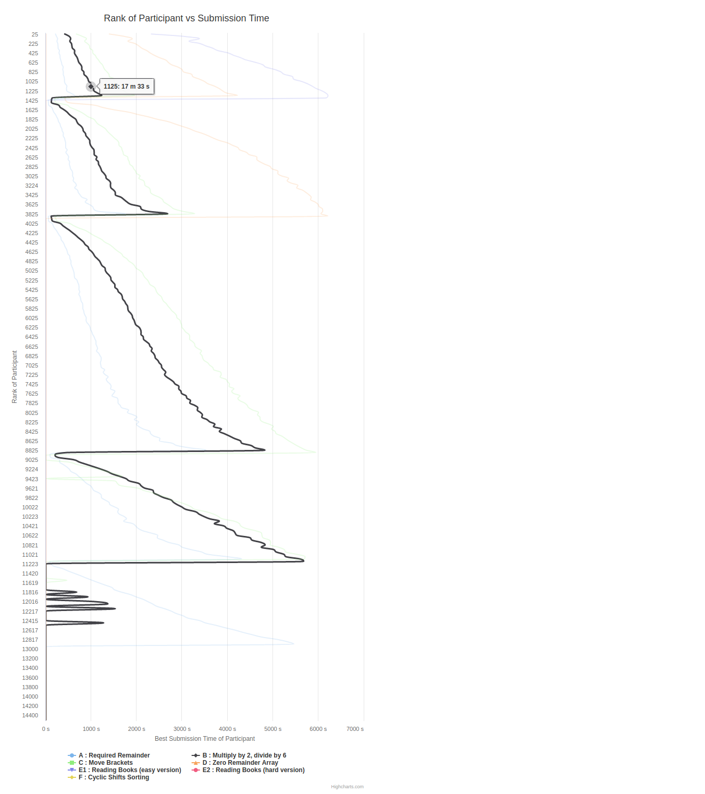
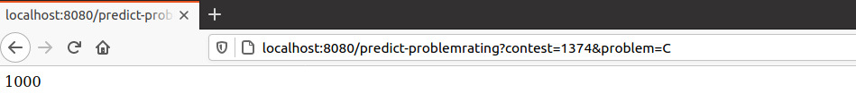
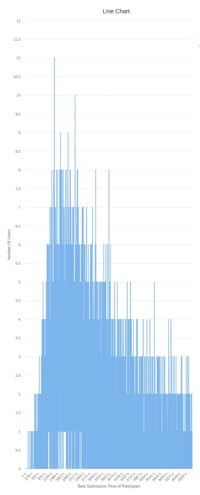
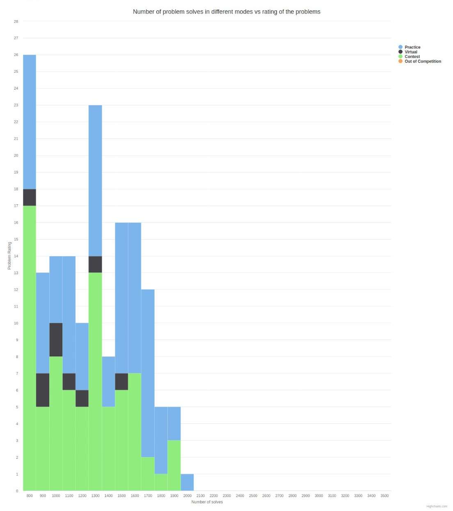

# CF COMPARATOR  
I made this project to get a more in-depth assessment of a user's performance in codeforces contests. All the images in this file are for the contest [Codeforces Round #653 (Div. 3)](https://codeforces.com/contest/1374). The features currently supported are - 
1) You can see the average time in which contestants in a certain rank range(say ranked 1600 - 1650) submitted a particular problem. In the image given you can select the problems you want to look at. Also here upon hovering the mouse on the black line we can see that user with a rank of arond 1125 submited B by the 17th minute.    
   

2) Predicting how hard the problem(problem rating) that you barely managed to solve or just missed towards the end actually was, right after the contest rating changes(official problem ratings take up to a few days to be declared). In the image problem rating of question C is shown.  
  

3) You can also see how many contestants had completed a problem at a given time. The graph is for problem C of the contest.  
  

4) I have also added a feature to check the number of problems of varying difficulties that you have solved in contest, in practice, as virtual participant, and as an out of contest participant. This is my favourite feature from [Codeforces Discord Bot](https://codeforces.com/blog/entry/68927) which also happens to be the inspiration behind this project.
  

I am planning to add more features and make changes to the existing ones soon. Some of these are - 
1) A percentile graph of where you stand among all codeforces users.  
2) I will also be adding the fraction of users who have completed a particular problem by a given time to the graph in feature 3 above.  

